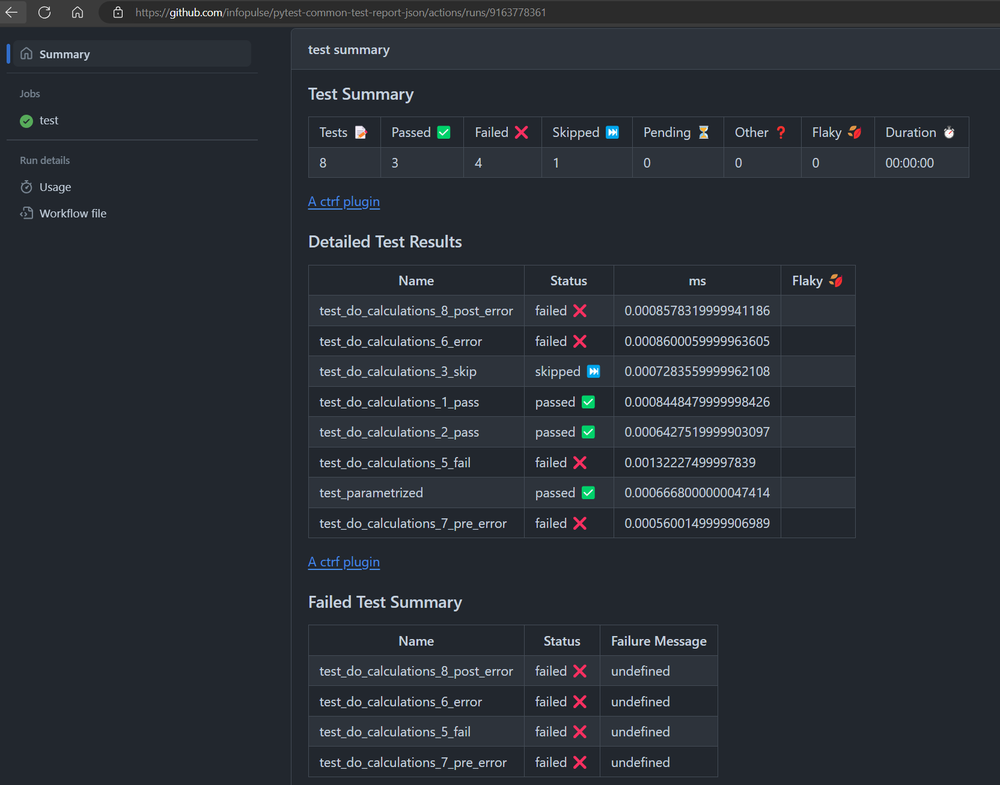

# CTRF for pytest

Pytest implementation of Common Test Report Format (CTRF) for test results.  
Test report will be generated in JSON format.  
Test report can be used to prettify the report in GitHub Actions with [github-actions-ctrf](https://github.com/ctrf-io/github-actions-ctrf).  
Do not worry if report in GitHub does not appear immediately. It takes some time to process the report. 

## Features
- Generates JSON report
- Tested to work correctly with and without [pytest-xdist](https://pypi.org/project/pytest-xdist/)
- Tested to get browser name from [pytest-playwright](https://pypi.org/project/pytest-playwright/)
- Parametrized tests are supported and reported as 1 test with multiple retries

## Installation

```bash
pip install pytest-json-ctrf
```

## Usage

generate report.json file in the root directory of the project. File path is mandatory

```bash
pytest --ctrf report.json
```

Environment Variables may be used to specify the required Environment Object
fields when using the CTRF [slack-test-reporter][ctrf-slack-test-reporter-url].

```bash
CTRF_BUILD_NAME="Pytest JSON CTRF Report"
CTRF_BUILD_NUMBER="000"
CTRF_BUILD_URL="https://ctrf.io]"
```

## Json exampe

More info here: https://ctrf.io/docs/schema/examples

```json
{
  "results": {
    "tool": {
      "name": "jest"
    },
    "summary": {
      "tests": 3,
      "passed": 1,
      "failed": 1,
      "pending": 0,
      "skipped": 1,
      "other": 0,
      "start": 1706644023,
      "stop": 1706644043
    },
    "environment": {
        "buildName": "Pytest JSON CTRF Report",
        "buildNumber": "000",
        "buildUrl": "https://ctrf.io"
    },
    "tests": [
      {
        "name": "User should be able to login",
        "status": "passed",
        "duration": 1200
      },
      {
        "name": "User profile information should be correct",
        "status": "failed",
        "duration": 800
      },
      {
        "name": "User should be able to logout",
        "status": "skipped",
        "duration": 0
      }
    ]
  }
}
```

## Report Example


## Technical details
For future me and others who are interested in the technical details of the implementation.  
The main idea is to handle xdist plugin because without it collecting report is quite straightforward.  
By the example of putest-json-report plugin, I have learned that different plugins can be registered for the controller and workers node.  
The `pytest_runtest_logreport` hook in the controller node is used to collect the test results from all the nodes so other nodes can just add some details to the `TestReport` object.

## Credits

- https://ctrf.io/ -> nice data format
- https://github.com/numirias/pytest-json-report -> Source of inspiration and dealing with xdist sync
- https://github.com/testomatio/pytestomatio -> Source of inspiration for creating pytest plugins
- https://github.com/infopulse/Playwright-course-python -> The report will be used in the demo project as +1 report option

### Roadmap
- Add screenshots handling
- Add hooks for the report extension

[ctrf-slack-test-reporter-url]: https://github.com/ctrf-io/slack-test-reporter
